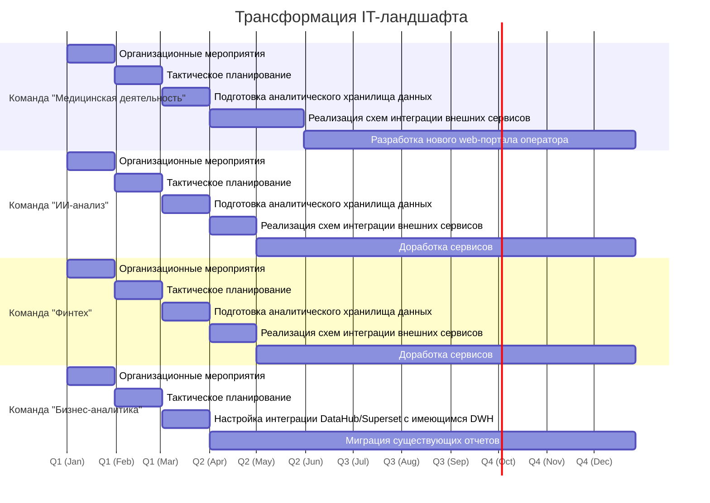

```mermaid
gantt
    title Трансформация IT-ландшафта
    dateFormat  YYYY-MM-DD
    axisFormat  Q%q (%b)
    section Команда "Медицинская деятельность"
    Организационные мероприятия                 :m1, 2026-01-01, 30d
    Тактическое планирование                    :m2, after m1, 30d
    Подготовка аналитического хранилища данных  :m3, after m2, 30d
    Реализация схем интеграции внешних сервисов :m4, after m3, 60d
    Разработка нового web-портала оператора     :m5, after m4, 210d
    section Команда "ИИ-анализ"
    Организационные мероприятия                      :ai1, 2026-01-01, 30d
    Тактическое планирование                         :ai2, after ai1, 30d
    Подготовка аналитического хранилища данных       :ai3, after ai2, 30d
    Реализация схем интеграции внешних сервисов      :ai4, after ai3, 30d
    Доработка сервисов :ai5, after ai4, 240d
    section Команда "Финтех"
    Организационные мероприятия                      :f1, 2026-01-01, 30d
    Тактическое планирование                         :f2, after f1, 30d
    Подготовка аналитического хранилища данных       :f3, after f2, 30d
    Реализация схем интеграции внешних сервисов      :f4, after f3, 30d
    Доработка сервисов :f5, after f4, 240d
    section Команда "Бизнес-аналитика"
    Организационные мероприятия                           :a1, 2026-01-01, 30d
    Тактическое планирование                              :a2, after a1, 30d
    Настройка интеграции DataHub/Superset с имеющимся DWH :a3, after a2, 30d
    Миграция существующих отчетов                         :a4, after a3, 270d
```